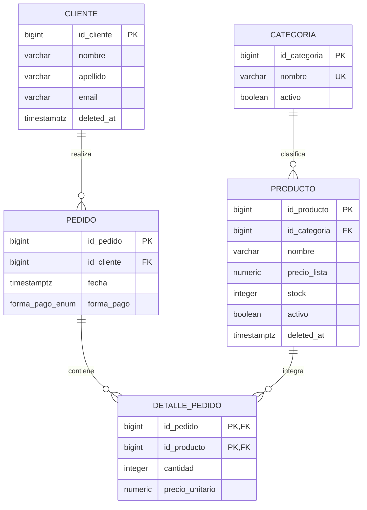

# Modelo entidad-relación

## Cardinalidad y participación

| Relación | Cardinalidad | Participación | Regla aplicada |
|---|---|---|---|
| Cliente - Pedido | 1:N | `pedido` total; `cliente` parcial | `pedido.id_cliente NOT NULL` y FK. |
| Categoría - Producto | 1:N | `producto` total; `categoria` parcial | `producto.id_categoria NOT NULL` y FK. |
| Pedido - Detalle | 1:N | `detalle_pedido` total; `pedido` parcial en el modelo físico | FK y PK compuesta. |
| Producto - Detalle | 1:N | `detalle_pedido` total; `producto` parcial | FK y trigger de producto vigente. |

La relación conceptual N:M entre `pedido` y `producto` se resuelve mediante la entidad asociativa `detalle_pedido`; sus atributos propios son `cantidad` y el precio histórico `precio_unitario`. Un pedido puede existir temporalmente sin detalle a nivel de tablas; el flujo de negocio `sp_tpi_registrar_pedido` crea pedido y detalle en una misma operación atómica.

El borrado lógico se representa con `deleted_at` en `cliente` y `producto`. No se elimina el historial de `pedido` ni de `detalle_pedido`.
